### Escuela Colombiana de Ingeniería
### Arquitecturas de Software - ARSW

## Escalamiento en Azure con Maquinas Virtuales, Sacale Sets y Service Plans

### Dependencias
* Cree una cuenta gratuita dentro de Azure. Para hacerlo puede guiarse de esta [documentación](https://azure.microsoft.com/en-us/free/search/?&ef_id=Cj0KCQiA2ITuBRDkARIsAMK9Q7MuvuTqIfK15LWfaM7bLL_QsBbC5XhJJezUbcfx-qAnfPjH568chTMaAkAsEALw_wcB:G:s&OCID=AID2000068_SEM_alOkB9ZE&MarinID=alOkB9ZE_368060503322_%2Bazure_b_c__79187603991_kwd-23159435208&lnkd=Google_Azure_Brand&dclid=CjgKEAiA2ITuBRDchty8lqPlzS4SJAC3x4k1mAxU7XNhWdOSESfffUnMNjLWcAIuikQnj3C4U8xRG_D_BwE). Al hacerlo usted contará con $200 USD para gastar durante 1 mes.

### Parte 0 - Entendiendo el escenario de calidad

Adjunto a este laboratorio usted podrá encontrar una aplicación totalmente desarrollada que tiene como objetivo calcular el enésimo valor de la secuencia de Fibonnaci.

**Escalabilidad**
Cuando un conjunto de usuarios consulta un enésimo número (superior a 1000000) de la secuencia de Fibonacci de forma concurrente y el sistema se encuentra bajo condiciones normales de operación, todas las peticiones deben ser respondidas y el consumo de CPU del sistema no puede superar el 70%.

### Parte 1 - Escalabilidad vertical

1. Diríjase a el [Portal de Azure](https://portal.azure.com/) y a continuación cree una maquina virtual con las características básicas descritas en la imágen 1 y que corresponden a las siguientes:
    * Resource Group = SCALABILITY_LAB
    * Virtual machine name = VERTICAL-SCALABILITY
    * Image = Ubuntu Server 
    * Size = Standard B1ls
    * Username = scalability_lab
    * SSH publi key = Su llave ssh publica


2. Para conectarse a la VM use el siguiente comando, donde las `x` las debe remplazar por la IP de su propia VM.

    `ssh scalability_lab@xxx.xxx.xxx.xxx`

3. Instale node, para ello siga la sección *Installing Node.js and npm using NVM* que encontrará en este [enlace](https://linuxize.com/post/how-to-install-node-js-on-ubuntu-18.04/).
4. Para instalar la aplicación adjunta al Laboratorio, suba la carpeta `FibonacciApp` a un repositorio al cual tenga acceso y ejecute estos comandos dentro de la VM:

    `git clone <your_repo>`

    `cd <your_repo>/FibonacciApp`

    `npm install`

5. Para ejecutar la aplicación puede usar el comando `npm FibinacciApp.js`, sin embargo una vez pierda la conexión ssh la aplicación dejará de funcionar. Para evitar ese compartamiento usaremos *forever*. Ejecute los siguientes comando dentro de la VM.

    `npm install forever -g`

    `forever start FibinacciApp.js`

6. Antes de verificar si el endpoint funciona, en Azure vaya a la sección de *Networking* y cree una *Inbound port rule* tal como se muestra en la imágen. Para verificar que la aplicación funciona, use un browser y user el endpoint `http://xxx.xxx.xxx.xxx:3000/fibonacci/6`. La respuesta debe ser `The answer is 8`.


7. La función que calcula en enésimo número de la secuencia de Fibonacci está muy mal construido y consume bastante CPU para obtener la respuesta. Usando la consola del Browser documente los tiempos de respuesta para dicho endpoint usando los siguintes valores:
    * 1000000
    * 1010000
    * 1020000
    * 1030000
    * 1040000
    * 1050000
    * 1060000
    * 1070000
    * 1080000
    * 1090000    

8. Dírijase ahora a Azure y verifique el consumo de CPU para la VM. (Los resultados pueden tardar 5 minutos en aparecer).

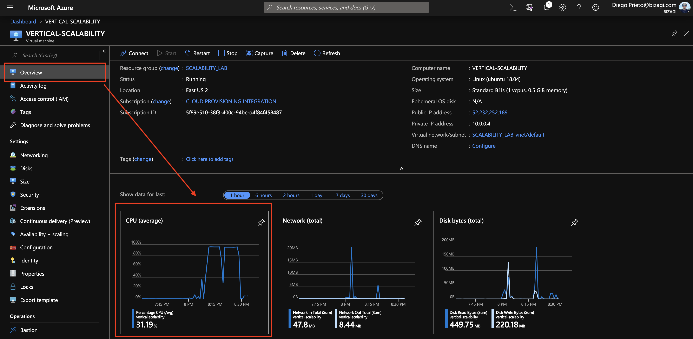

9. Ahora usaremos Postman para simular una carga concurrente a nuestro sistema. Siga estos pasos.
    * Instale newman con el comando `npm install newman -g`. Para conocer más de Newman consulte el siguiente [enlace](https://learning.getpostman.com/docs/postman/collection-runs/command-line-integration-with-newman/).
    * Diríjase hasta la ruta `FibonacciApp/postman` en una maquina diferente a la VM.
    * Para el archivo `[ARSW_LOAD-BALANCING_AZURE].postman_environment.json` cambie el valor del parámetro `VM1` para que coincida con la IP de su VM.
    * Ejecute el siguiente comando.

    ```
    newman run ARSW_LOAD-BALANCING_AZURE.postman_collection.json -e [ARSW_LOAD-BALANCING_AZURE].postman_environment.json -n 10 &
    newman run ARSW_LOAD-BALANCING_AZURE.postman_collection.json -e [ARSW_LOAD-BALANCING_AZURE].postman_environment.json -n 10
    ```

10. La cantidad de CPU consumida es bastante grande y un conjunto considerable de peticiones concurrentes pueden hacer fallar nuestro servicio. Para solucionarlo usaremos una estrategia de Escalamiento Vertical. En Azure diríjase a la sección *size* y a continuación seleccione el tamaño `B2ms`.


11. Una vez el cambio se vea reflejado, repita el paso 7, 8 y 9.
12. Evalue el escenario de calidad asociado al requerimiento no funcional de escalabilidad y concluya si usando este modelo de escalabilidad logramos cumplirlo.
13. Vuelva a dejar la VM en el tamaño inicial para evitar cobros adicionales.

**Preguntas**

1. ¿Cuántos y cuáles recursos crea Azure junto con la VM?

    1. Red virtual
    2. Cuenta de almacenamiento
    3. Dirección IP pública
    4. Grupo de seguridad de red
    5. Interfaz de red
    6. Disco
2. ¿Brevemente describa para qué sirve cada recurso?
    1. Red virtual : Es una red privada en azure que permite que distintos recursos se puedan comunicar entre ellos, el internet y redes on-premise de forma segura
    2. Cuenta de almacenamiento: contiene todos los objetos de datos de Azure Storage:  archivos, tablas, discos,etc .
    3. Dirección IP pública: Permite acceder remotamente al recurso desde redes externas
    4. Grupo de seguridad de red:Un grupo de seguridad de la red contiene reglas de seguridad que permiten o restringen el tráfico de entrada a la red o el tráfico de salida de la red a partir de varios tipos de recursos de Azure.
    5. Interfaz de red :permite que la máquina se comunique con el internet y con otros recursos en la red local
    6. Disco : sirve para expandir las capacidades de almacenamiento de la máquina

3. ¿Al cerrar la conexión ssh con la VM, por qué se cae la aplicación que ejecutamos con el comando `npm FibonacciApp.js`? ¿Por qué debemos crear un *Inbound port rule* antes de acceder al servicio?
    * Porque cuando se cierra la terminal ssh esta manda un llamado a todos los procesos para que se cierren
    forever se encarga de matener ejecutando el script y que cuando se cierre la conexión ssh y se intente cerrar el proceso se vuelva
    a ejecutar para mantenerlo activo.
    * Se tuvo que crear un Inbound port rule para poder abrir este puerto en la máquina y permitir el tráfico de red por este
4. Adjunte tabla de tiempos e interprete por qué la función tarda tando tiempo.

## A0
| Caso | Tiempo(min)|
|---------|--------|
| 1000000 | 1.7 |
| 1010000 | 1.8 |
| 1020000 | 1.8 |
| 1030000 | 1.9 |
| 1040000 | 1.9 |
| 1050000 | 2.0 |
| 1060000 | 2.0 |
| 1070000 | 2.0 |
| 1080000 | 2.1 |
| 1090000 | 2.1 |

## A6
| Caso    | Tiempo(s) |
|---------|-----------|
| 1000000 | 48.97     |
| 1010000 | 50.9      |
| 1020000 | 51.69     |
| 1030000 | 53.34     |
| 1040000 | 53.98     |
| 1050000 | 55.82     |
| 1060000 | 56.67     |
| 1070000 | 57.3      |
| 1080000 | 59.62     |
| 1090000 | 60.3      |

La función tarda mucho tiempo porque el calculo de fibonacci esta implementado con complejidad O(n) 
por lo que las entradas grandes implican bastantes calculos,además al realizar siempre todas las operaciones
sin hacer uso de memorización, cada petición debe re calcular todo el numero desde 0.
    
5. Adjunte imágen del consumo de CPU de la VM e interprete por qué la función consume esa cantidad de CPU.

## A0
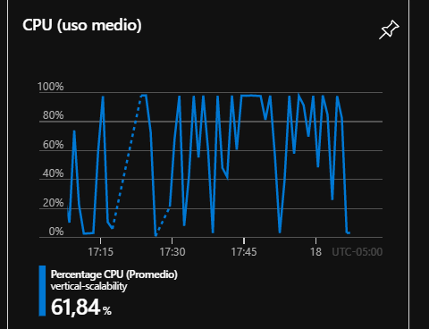

La función se mantiene haciendo operaciones matemáticas con numeros grandes durante un largo periodo de tiempo 
y dado que la capacida de la maquina es muy poca este proceso es suficiente para llevar a un alto consumo (90%+) mientras
la petición se esta ejecutando.

## A6
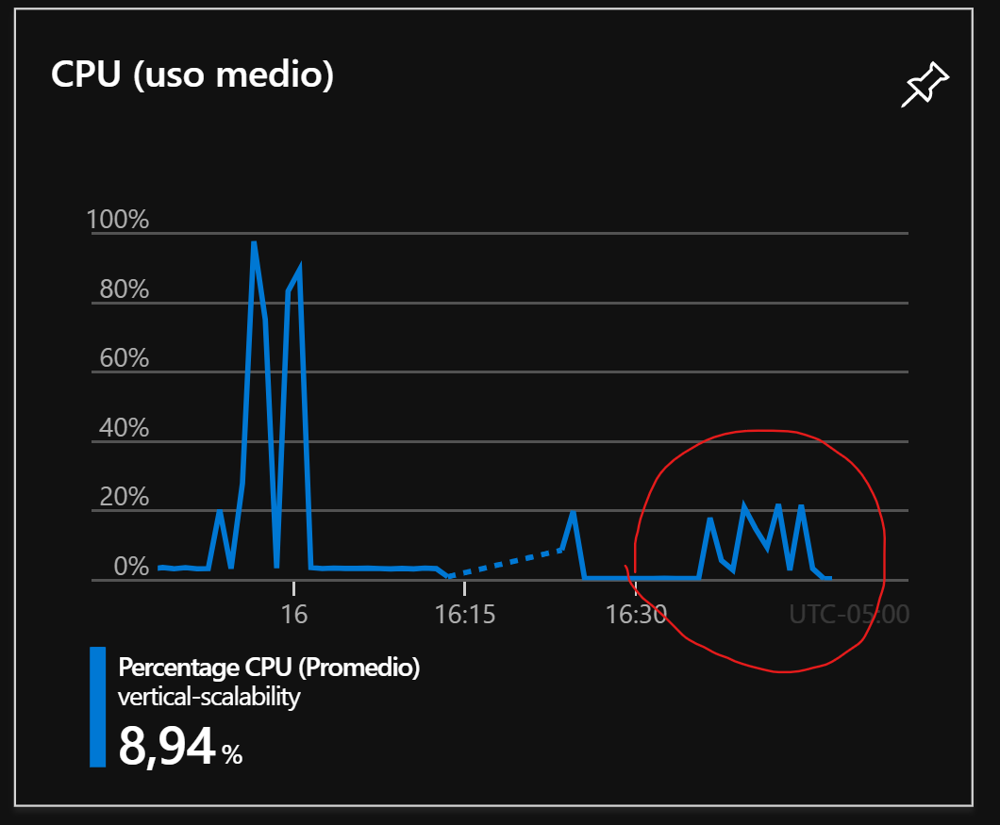

Como vemos al aumentar los recursos de la máquina virtual, aunque el algoritmos sigue realizando
las mismas operaciones ahora estas corresponden a un menor porcentaje del total de CPU de la vm

6. Adjunte la imagen del resumen de la ejecución de Postman. Interprete:

## A0
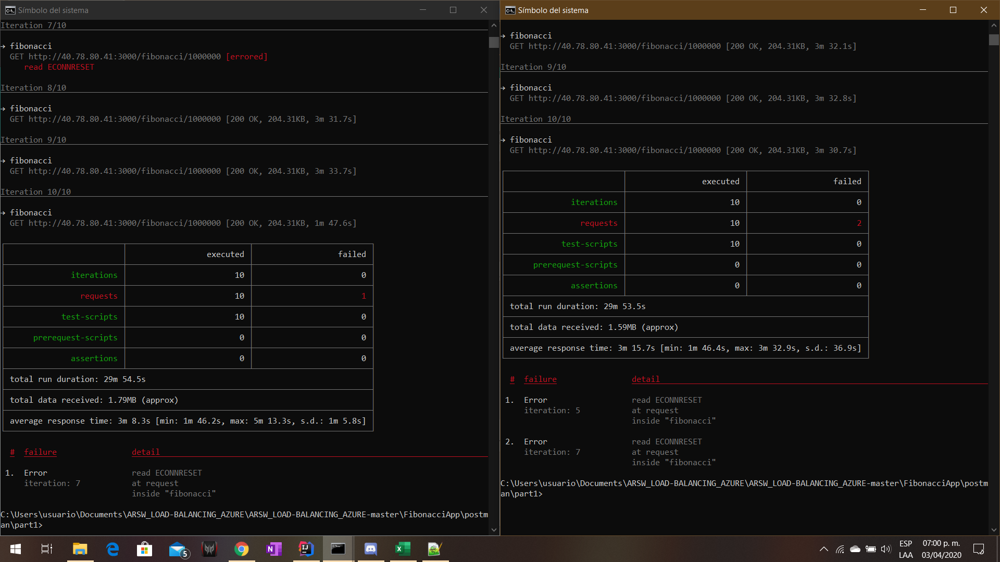

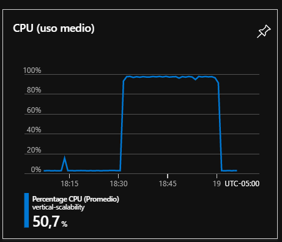

Según lo visto en la imagen en promedio cada petición tarda en promedio 3 minutos, lo que es superior al tiempo
obtenido al correr el mismo caso de forma independiente, esto se debe a que el servidore debe
repatir su capacidad de procesamiento para responder a dos consultas de forma concurrente, por lo que
el tiempo de respuesta de cada petición se ve afectado. Los errores se generaron porque en algunos momentos
el servidor no contaba con recursos libres disponibles para asignar al calculo de la respuesta de la petición por lo que se
generaba un error.
 
 También hay que destacar que destacar que el consumo de CPU del servidor se mantuvo alto (95%+) durante todo el proceso
 
 ## A6
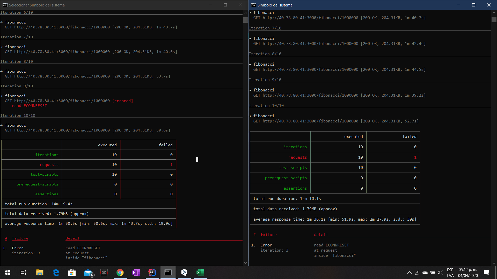
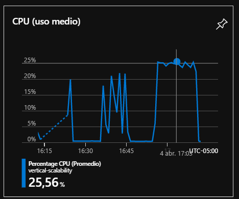
 
 Con el nuevo tamaño se redujo el numero de errores y el consumo de Cpu del servidor 
 
7. ¿Cuál es la diferencia entre los tamaños `A0` y `A6` (no solo busque especificaciones de infraestructura)?

El tamaño A0 está sobre suscrito en el hardware físico. Sólo para este tamaño específico, otros despliegues del cliente pueden afectar el rendimiento de su carga de trabajo en ejecución. El rendimiento relativo se describe a continuación como la línea de base esperada, sujeta a una variabilidad aproximada del 15 por ciento.

Además el tamaño A0 es mucho mas económico que el tamaño A6

| Tamaño | Vcpu | RAM(GiB) | Discos de datos | Almacenamiento temporal | Max NICs/ Ancho de banda de la red |
|--------|------|----------|-----------------|-------------------------|------------------------------------|
| A0     | 1    | 0.75     | 1               | 20                      | 1/Bajo                             |
| A6     | 4    | 28       | 8               | 1000                    | 2/Alto                             |

8. ¿Aumentar el tamaño de la VM es una buena solución en este escenario?, ¿Qué pasa con la FibonacciApp cuando cambiamos el tamaño de la VM?

Es una buena solución para bajar la carga del servidor y poder obtener mayor velocidad de respuesta puesto
que con el nuevo tamaño se ejecutan más operaciones en menos tiempo, sin embargo el sistema aún no soporta que 
muchos usuarios efectuen peticiones de forma concurrente sin que el tiempo y la cantidad de respuestas se 
vea afectada 

FibonacciApp deja de correr porque al cambiar el tamaño la máquina debe reiniciarse

9. ¿Qué pasa con la infraestructura cuando cambia el tamaño de la VM? ¿Qué efectos negativos implica?

La máquina debe reiniciarse para poder cambiar el tamaño, como efecto negativo implica que el servicio
no esté disponible mientras se realiza el escalamiento.

10. ¿Hubo mejora en el consumo de CPU o en los tiempos de respuesta? Si/No ¿Por qué?

Tanto el consumo de CPU como el tiempo de respuesta mejoraron. Esto se debe a que se aumentó la capacidad de 
procesamiento de la máquina , se añadieron 3 Vcpu y 27GiB de RAM , por lo que las operaciones realizadas representaban
 un porcentaje de  CPU menor y se realizaban en menos tiempo.

11. Aumente la cantidad de ejecuciones paralelas del comando de postman a `4`. ¿El comportamiento del sistema es porcentualmente mejor?

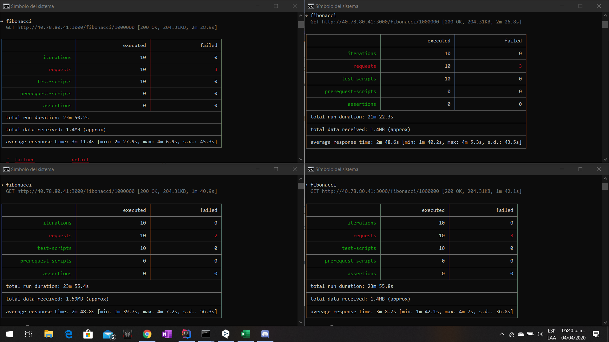

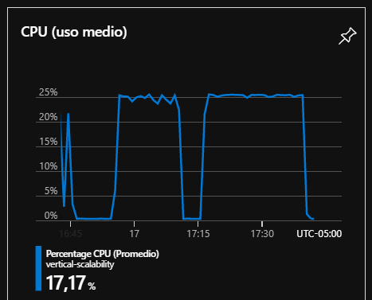

El comportamiento en términos de cantidad de peticiones realizadas exitosamente es peor que cuando se enviaban 2 ejecuciones
paralelas de postman. En el caso de 4 ejecuciones paralelas tenemos que el 72.5% de las peticiones fueron exitosas, mientras
que en el caso de 2 ejecucioens paralelas tenemos que el 90% de las peticiones fueron exitosas.

En terminos de consumo de CPU ambos casos presentan el mismo comportamiento de consumo, aproximadamente
25% de la CPU

### Parte 2 - Escalabilidad horizontal

#### Crear el Balanceador de Carga

Antes de continuar puede eliminar el grupo de recursos anterior para evitar gastos adicionales y realizar la actividad en un grupo de recursos totalmente limpio.

1. El Balanceador de Carga es un recurso fundamental para habilitar la escalabilidad horizontal de nuestro sistema, por eso en este paso cree un balanceador de carga dentro de Azure tal cual como se muestra en la imágen adjunta.


2. A continuación cree un *Backend Pool*, guiese con la siguiente imágen.


3. A continuación cree un *Health Probe*, guiese con la siguiente imágen.


4. A continuación cree un *Load Balancing Rule*, guiese con la siguiente imágen.


5. Cree una *Virtual Network* dentro del grupo de recursos, guiese con la siguiente imágen.


#### Crear las maquinas virtuales (Nodos)

Ahora vamos a crear 3 VMs (VM1, VM2 y VM3) con direcciones IP públicas standar en 3 diferentes zonas de disponibilidad. Después las agregaremos al balanceador de carga.

1. En la configuración básica de la VM guíese por la siguiente imágen. Es importante que se fije en la "Avaiability Zone", donde la VM1 será 1, la VM2 será 2 y la VM3 será 3.


2. En la configuración de networking, verifique que se ha seleccionado la *Virtual Network*  y la *Subnet* creadas anteriormente. Adicionalmente asigne una IP pública y no olvide habilitar la redundancia de zona.


3. Para el Network Security Group seleccione "avanzado" y realice la siguiente configuración. No olvide crear un *Inbound Rule*, en el cual habilite el tráfico por el puerto 3000. Cuando cree la VM2 y la VM3, no necesita volver a crear el *Network Security Group*, sino que puede seleccionar el anteriormente creado.


4. Ahora asignaremos esta VM a nuestro balanceador de carga, para ello siga la configuración de la siguiente imágen.


5. Finalmente debemos instalar la aplicación de Fibonacci en la VM. para ello puede ejecutar el conjunto de los siguientes comandos, cambiando el nombre de la VM por el correcto

```
git clone https://github.com/daprieto1/ARSW_LOAD-BALANCING_AZURE.git

curl -o- https://raw.githubusercontent.com/creationix/nvm/v0.34.0/install.sh | bash
source /home/vm1/.bashrc
nvm install node

cd ARSW_LOAD-BALANCING_AZURE/FibonacciApp
npm install

npm install forever -g
forever start FibonacciApp.js
```

Realice este proceso para las 3 VMs, por ahora lo haremos a mano una por una, sin embargo es importante que usted sepa que existen herramientas para aumatizar este proceso, entre ellas encontramos Azure Resource Manager, OsDisk Images, Terraform con Vagrant y Paker, Puppet, Ansible entre otras.

#### Probar el resultado final de nuestra infraestructura

1. Porsupuesto el endpoint de acceso a nuestro sistema será la IP pública del balanceador de carga, primero verifiquemos que los servicios básicos están funcionando, consuma los siguientes recursos:

```
http://52.155.223.248/
http://52.155.223.248/fibonacci/1
```

2. Realice las pruebas de carga con `newman` que se realizaron en la parte 1 y haga un informe comparativo donde contraste: tiempos de respuesta, cantidad de peticiones respondidas con éxito, costos de las 2 infraestrucruras, es decir, la que desarrollamos con balanceo de carga horizontal y la que se hizo con una maquina virtual escalada.

* Tablas de tiempo con 2 en paralelo
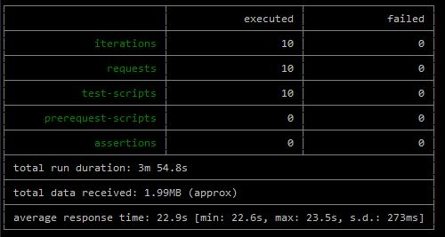
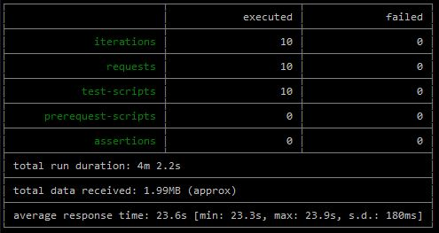
* Rendimiento de CPU
    * MV1: 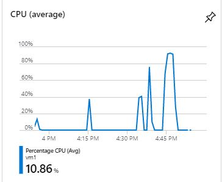
    * MV2: 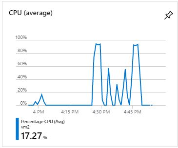
    * MV3: 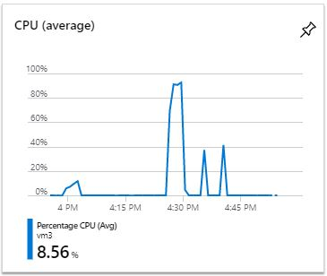


3. Agregue una 4 maquina virtual y realice las pruebas de newman, pero esta vez no lance 2 peticiones en paralelo, sino que incrementelo a 4. Haga un informe donde presente el comportamiento de la CPU de las 4 VM y explique porque la tasa de éxito de las peticiones aumento con este estilo de escalabilidad.

```
newman run ARSW_LOAD-BALANCING_AZURE.postman_collection.json -e [ARSW_LOAD-BALANCING_AZURE].postman_environment.json -n 10 &
newman run ARSW_LOAD-BALANCING_AZURE.postman_collection.json -e [ARSW_LOAD-BALANCING_AZURE].postman_environment.json -n 10 &
newman run ARSW_LOAD-BALANCING_AZURE.postman_collection.json -e [ARSW_LOAD-BALANCING_AZURE].postman_environment.json -n 10 &
newman run ARSW_LOAD-BALANCING_AZURE.postman_collection.json -e [ARSW_LOAD-BALANCING_AZURE].postman_environment.json -n 10
```

* Tablas de tiempo con 4 en paralelo:
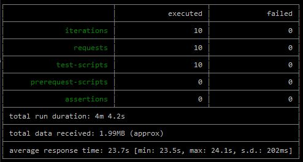
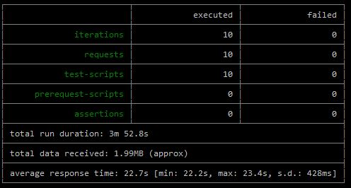
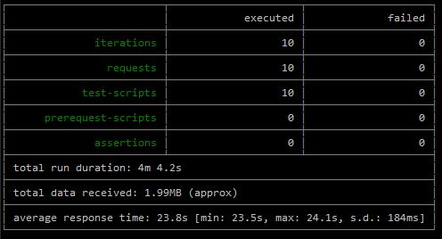
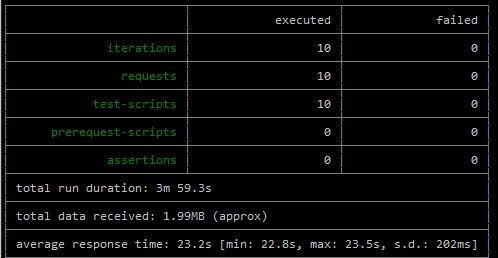

* Rendimiento de CPU
    * MV1: 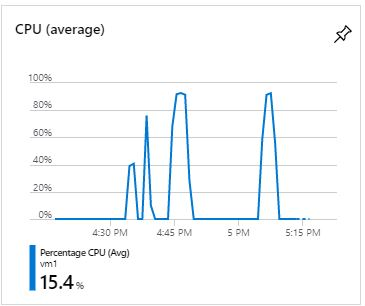
    * MV2: 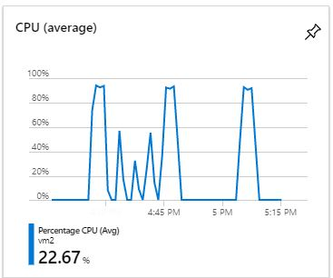
    * MV3: 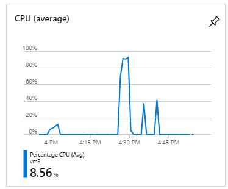
    * MV4: 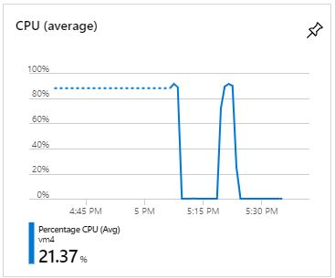

**Preguntas**

* ¿Cuáles son los tipos de balanceadores de carga en Azure y en qué se diferencian?, ¿Qué es SKU, qué tipos hay y en qué se diferencian?, ¿Por qué el balanceador de carga necesita una IP pública?
    * `Equilibrador de carga público:` Proporcionar conexiones de salida para máquinas virtuales dentro de la red virtual.Estas conexiones se realizan mediante la traducción de sus direcciones IP privadas a direcciones IP públicas.
    * `Equilibrador de carga privado:` Se usa cuando se necesitan direcciones IP privadas solo en el front-end. Los equilibradores de carga privados se usan para equilibrar la carga del tráfico dentro de una red virtual.

* ¿Cuál es el propósito del *Backend Pool*?
    * `Backend Pool:` Se refiere al conjunto de backends que reciben un tráfico similar para su aplicación. En otras palabras, es una agrupación lógica de las instancias de su aplicación en todo el mundo que reciben el mismo tráfico y responden con el comportamiento esperado. Estos "backends" se despliegan a través de diferentes regiones o dentro de la misma región. Todos los backends pueden estar en modo de despliegue Activo/Activo o lo que se define como configuración Activo/Pasivo.

* ¿Cuál es el propósito del *Health Probe*?
    * `Health probe:` Permite que el equilibrador de carga detecte el estado del punto final del extremo trasero. La configuración del health probe y las respuestas del probe determinan qué instancias del conjunto del backend recibirán nuevos flujos. Puede utilizar health probe para detectar el fallo de una aplicación en un punto final del backend. También puede generar una respuesta personalizada a un health probe y utilizar el health probe para el control del flujo para gestionar la carga o el tiempo de inactividad planificado.

* ¿Cuál es el propósito de la *Load Balancing Rule*? ¿Qué tipos de sesión persistente existen, por qué esto es importante y cómo puede afectar la escalabilidad del sistema?.
    * `Load Balancing Rule:` Define la configuración de IP de interfaz para el tráfico entrante y el grupo de back-end para recibir el tráfico, junto con el puerto de origen y destino requerido.
    * Proporciona equilibrio de carga entrante y la regla de salida controla el NAT saliente proporcionado para la VM. Este inicio rápido utiliza dos grupos de backend separados, uno para entrada y otro para salida, para ilustrar la capacidad y permitir flexibilidad para este escenario.

* ¿Qué es una *Virtual Network*? ¿Qué es una *Subnet*? ¿Para qué sirven los *address space* y *address range*?
    * `Virtual Network:` Permite que muchos tipos de recursos de Azure, como las Máquinas Virtuales Azure (VM), se comuniquen de forma segura entre sí, con Internet y con las redes locales.
    * `Subnet:` Permiten segmentar la red virtual en una o más subredes y asignar una porción del espacio de direcciones de la red virtual a cada subred. Luego puede desplegar recursos de Azure en una subred específica. Al igual que en una red tradicional, las subredes le permiten segmentar el espacio de direcciones de la red virtual en segmentos que son apropiados para la red interna de la organización. Esto también mejora la eficiencia de la asignación de direcciones.
    * `Address space:` Cuando se crea una Virtual Network, se debe especificar un espacio de direcciones IP privadas personalizadas utilizando direcciones públicas y privadas (RFC 1918). Azure asigna a los recursos de una red virtual una dirección IP privada del espacio de direcciones que usted asigne.
    * `Address range:` El rango de direcciones que defina puede ser público o privado (RFC 1918). Ya sea que defina el rango de direcciones como público o privado, solo se puede acceder al rango de direcciones desde la red virtual, desde redes virtuales interconectadas y desde cualquier red local que haya conectado a la red virtual.

* ¿Qué son las *Availability Zone* y por qué seleccionamos 3 diferentes zonas?. ¿Qué significa que una IP sea *zone-redundant*?
    * `Availability Zone:` Es una oferta de alta disponibilidad que protege sus aplicaciones y datos de las fallas del centro de datos. Las zonas de disponibilidad son ubicaciones físicas únicas dentro de una región azul. Cada zona está compuesta por uno o más centros de datos equipados con energía, refrigeración y redes independientes. Para garantizar la resiliencia, hay un mínimo de tres zonas separadas en todas las regiones habilitadas. La separación física de las zonas de disponibilidad dentro de una región protege las aplicaciones y los datos de las fallas del centro de datos.
	* `Zone-redundant:` La plataforma se replica automáticamente en todas las zonas (por ejemplo, almacenamiento redundante por zonas, base de datos SQL).

* ¿Cuál es el propósito del *Network Security Group*?
    * `Network Security Group:` Contiene las reglas de seguridad que permiten o deniegan el tráfico de entrada a la red o el tráfico de salida de la red a partir de varios tipos de recursos del Azure.

* Informe de newman 1 (Punto 2)
* Presente el Diagrama de Despliegue de la solución.


